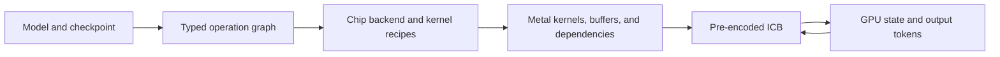

# lithos-metal architecture

lithos-metal compiles language-model graphs into a GPU-resident execution program for Apple silicon.
The program combines layer-wise mixer megakernels with conventional Metal kernels. A megakernel
contains a bounded sequence of dependent tasks; the full generation loop is replayed through a
Metal indirect command buffer (ICB).

This document describes the current architecture and its contracts. Related designs:
[Apple GPU execution](apple-gpu.md), [mixer megakernels](mixers.md), and
[speculative decoding](speculative-decoding.md).

Numbered design decisions and section references in older source comments refer to the
[original design snapshot](https://github.com/lithos-ai/lithos-metal/blob/46b2bc4cda57826c072d94afe90a58633aaeb6d9/docs/design/design.md).

## Compilation and execution

1. A registered model package interprets checkpoint configuration, declares weights and persistent state,
   and composes the shared layer library.
2. Layer lowering emits a typed graph of operations, values, and state updates. The coverage guard rejects
   operations that have no kernel implementation for the selected backend.
3. The compiler and chip backend choose operand layouts, tile geometry, fusion regions, scratch storage,
   and synchronization boundaries.
4. The emitted `Program` describes specialized Metal sources, buffer bindings, threadgroup geometry,
   and operation ordering.
5. The native runtime compiles pipelines, allocates or maps buffers, and encodes the program for replay.
   GPU state supplies the values that change between steps.

Implementation entry points are [compile_program](../../monolith/compiler/emit.py),
[Program](../../monolith/runtime/program.py), and [Engine](../../monolith/runtime/engine.py).

## Fusion boundaries

The compiler fuses operations when their dependencies, layouts, and storage requirements permit useful
reuse. In selected GDN and full-attention configurations, one layer's mixer becomes a single megakernel;
the MLP remains a separate region. Draft mixers use the same compiler mechanisms.

A worker is a Metal threadgroup. It executes projection tiles, attention partitions, state slices, or
reductions according to the selected schedule. Worker counts are logical launch parameters, not physical
core assignments. Values owned by one worker can remain local. Values exchanged between workers require
explicit storage, memory ordering, and synchronization.

Fusion selection belongs to the chip backend and can depend on shapes, formats, active-row bounds, and
context. An available fused implementation is not automatically the default. Native kernels remain
available when their complete-region cost is better or the fusion's preconditions do not hold.

See [mixer design](mixers.md) for the task graphs and [backend ownership](../../monolith/backends/metal/README.md)
for the extension interface.

## Runtime program

`Program` is the boundary between the Python compiler and the native runtime:

| Component | Contract |
| --- | --- |
| `KernelSpec` | Metal source, entry point, specialization macros, and language version |
| `BufferSpec` | Size, initial data or mapped file range, and lifetime role |
| `OpSpec` | Kernel, bindings, launch geometry, threadgroup storage, and dependency boundary |
| `StepStateLayout` | Shared binary layout for GPU-resident generation control |
| Backend identity | Backend ID and configuration digest associated with the compiled program |
| Context capacity | Bound enforced before a step accesses persistent caches |

The runtime replays a static operation sequence. Kernels use active-row counts and stop state to select
work within their compiled bounds. A later replay can return without doing work after the sequence has
finished. The host submits bounded batches of work and reads output tokens.

An ICB barrier orders dependent dispatches. The compiler may omit a boundary only after establishing that
the relevant operations can run independently. Inside a megakernel, threadgroup barriers protect local
scratch; cross-worker publication follows Metal's device-memory ordering rules. All spin loops and task
queues must be bounded.

## Generation state and buffer lifetimes

[StepState](../../monolith/core/step_state.py) records the current position, committed context length,
active rows, anchor and proposals, verification length, accepted count, recurrent-state checkpoint,
random-number state, stop/error flags, and token-ring cursors. Its layout is shared by the compiler and runtime.

Buffers have distinct ownership:

- **Weights:** immutable packed checkpoint data, which can be mapped read-only and shared between programs.
- **Persistent state:** target K/V, convolution and recurrent state, draft context, and generation control.
- **Scratch:** temporary activations and partial results; storage may be reused after the last consumer.
- **Parameters:** records owned by a particular program, including its shapes and binding offsets.
- **Output ring:** tokens published by GPU control operations and consumed by the host.

Programs within a session can share persistent buffers by name. Parameter records are program-specific.
Scratch allocation must never alias live persistent state, acceptance logs, or output buffers.
Sequential attention layers share one workspace per partial-result kind, sized for the largest consumer;
dependency barriers order reuse instead of retaining a separate context-sized workspace for every layer.

The output ring uses sequence-tagged slots to distinguish new data from wrapped entries. The program stops
on token limits, EOS/stop conditions, context exhaustion, ring overflow, or a bounded synchronization failure.
A cancelled request finishes its active Metal dispatch before further work stops.

## Prefill and decode

Prefill and decode use different row counts and may require different projection and attention layouts.
A session specializes programs for prompt chunks and generation, while sharing compatible persistent state.

Prompt specialization commits all prompt rows, skips unnecessary intermediate sampling, and avoids replaying
GDN updates already performed by the prompt kernel. The final prompt chunk hands its state to the decoder.
Short prompt tails can use the resident decoder when their row count and recipe are compatible.

Prefill scratch is planned by lifetime. Derived packed layouts preserve checkpoint codes and scales unless
quantization is explicitly requested. Layout caches are distinct from the original checkpoint and packs.
Exact prefill can process larger chunks while preserving the reduction orders of the 128-row reference graph.
Compatible prompt and verification kernels share packed weight mappings, reducing duplicate residency.
The backend selects the qualified geometry and the session handles reference-path fallbacks;
see [prefill policy](serving.md#prefill-policy).

The serving layer adds exact-token prefix checkpoints. A cache hit must match the actual token prefix,
including system instructions and tool definitions; it restores target and draft state consistently.
See [serving](serving.md) for request behavior and configuration.

## Weights and numerical behavior

A model declares a weight map. Format plugins interpret checkpoint storage, and the packer applies the
layout transformations needed by the selected backend. The manifest records slabs, auxiliary tensors,
formats, permutations, and capacity. Model-specific naming and checkpoint adaptations stay in model packages.

The general arithmetic convention is weight-only dequantization, BF16 activations/residuals, and FP32
accumulation and recurrent state. A checkpoint's storage format does not imply its original activation
quantization is reproduced. References use the same decoded weights and the model's normalization,
rotary-position, gating, and residual conventions.

Some optimizations intentionally change rounding. In particular, commuted input normalization is enabled
by default for eligible projections. Its formula, eligibility, and opt-out are documented in
[input-normalization fusion](mixers.md#input-normalization-fusion). Numerical qualification must identify
which path it uses.

Correctness checks cover synthetic contracts, individual kernels, complete layers, and model continuation.
Speculative checks include token decisions and persistent state. Repeated deterministic runs must agree,
and shader validation checks binding bounds independently of numerical comparisons.
See [contributing](../../CONTRIBUTING.md) for test tiers.

## Module boundaries

| Directory | Responsibility |
| --- | --- |
| [monolith/models](../../monolith/models) | Architecture configuration, checkpoint conventions, graph composition |
| [monolith/nn](../../monolith/nn) | Shared layers and oracle behavior |
| [monolith/formats](../../monolith/formats) and [monolith/packs](../../monolith/packs) | Quantization formats, packing, manifests, and transforms |
| [monolith/ops](../../monolith/ops) and [monolith/core](../../monolith/core) | Operation contracts, typed IR, shapes, and generation-state layout |
| [monolith/compiler](../../monolith/compiler) | Lowering, fusion, memory planning, barriers, and Metal emission |
| [monolith/backends/metal](../../monolith/backends/metal) | Device selection, recipes, scheduling, and kernel overrides |
| [monolith/spec](../../monolith/spec) | Draft models, verification selection, and speculative graph construction |
| [monolith/runtime](../../monolith/runtime) and [runtime](../../runtime) | Program ABI, GPU buffers, ICB replay, and token streaming |
| [monolith/serving](../../monolith/serving) | Checkpoint resolution, client launchers, protocol adapters, and prefix caching |

New models compose registered components rather than adding model-name conditionals to the compiler or
runtime. New operations, formats, and drafters define their own contracts and tests. See the
[extension contracts](extensions.md).

## Portability and reuse

Backend selection uses chip name, GPU family, and core count. Separate core-count variants own independent
recipes and caches. Unmeasured configurations use conservative native fallbacks until qualified.
Correctness depends on documented Metal semantics; residency, overlap, and bandwidth observations guide
performance choices only.

The task-based approach is informed by [Mirage Persistent Kernel](https://arxiv.org/abs/2512.22219).
lithos-metal is a standalone implementation with no MPK/Mirage runtime dependency.
Adapted code retains its license and provenance in [third_party/NOTICE](../../third_party/NOTICE).
